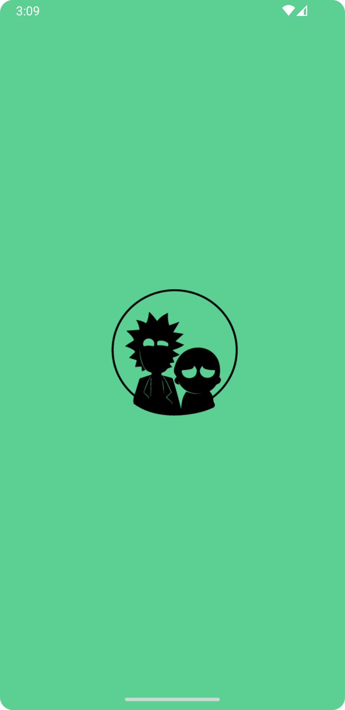
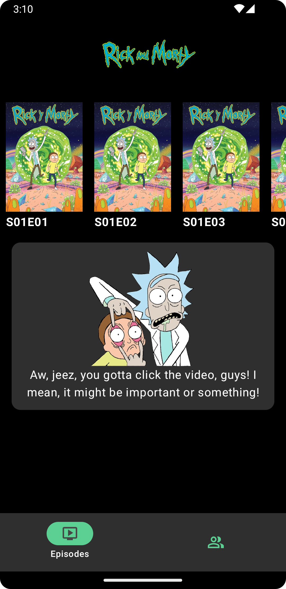
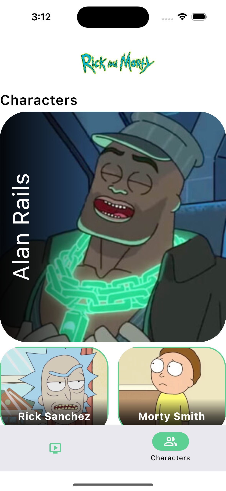
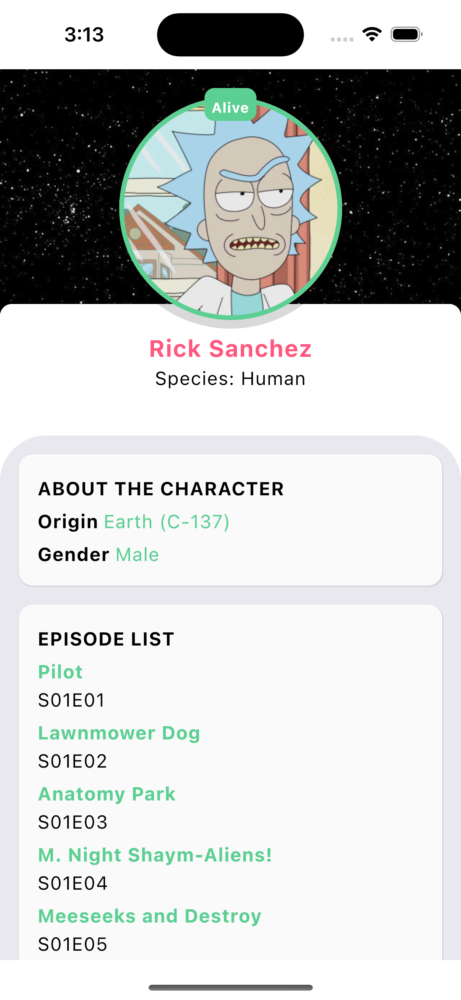
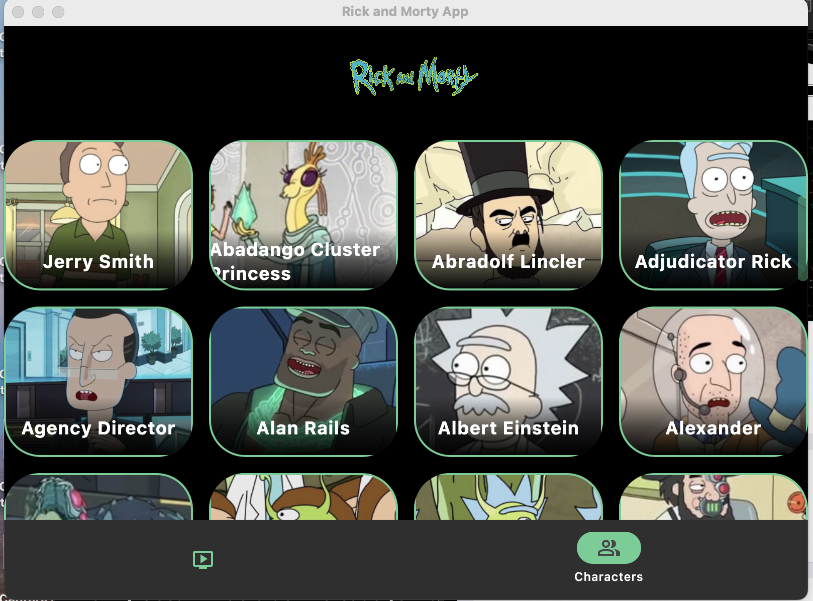

# Rick and Morty App - CMP

A app of a KMP and CMP course by Aristidevs. This is a perfect example how to create a App for Android, following the best practices for Multifplaform development -> Android, iOS, Desktop:

## Authors

- [@EdderRamos](https://www.github.com/EdderRamos)
- Teacher: [@ArisGuimera](https://github.com/ArisGuimera)

## 🛠️ Tech Stack

### Main Technologies
- **Framework:** Jetpack Compose Multiplatform
- **Language:** Kotlin

### Architecture & Design
- **Navigation:** [Navigation Compose](https://developer.android.com/jetpack/compose/navigation)
- **Dependency Injection:** [Koin](https://insert-koin.io/)
- **Networking:** [Ktor](https://ktor.io/)
- **Image Loading:** [Coil](https://coil-kt.github.io/coil/)

### Additional Tools
- **Asynchronous Programming:** Coroutines
- **Build Tool:** Gradle KTS
---

## Features

- Splash Screen 
- Episodes Screen with Video Player
- Characters and Detail Screen 

## API RICK AND MORTY

#### GET - CHARACTERS
- [Characters](https://rickandmortyapi.com/api/character)

#### GET - EPISODES
- [Episodes](https://rickandmortyapi.com/api/episode)

## Support

For support, email lee_jhonatan_22@hotmail.com

## Screenshots
### Android

### iOS

### Desktop

